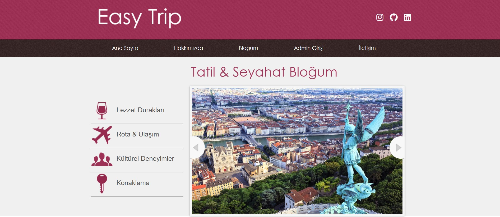
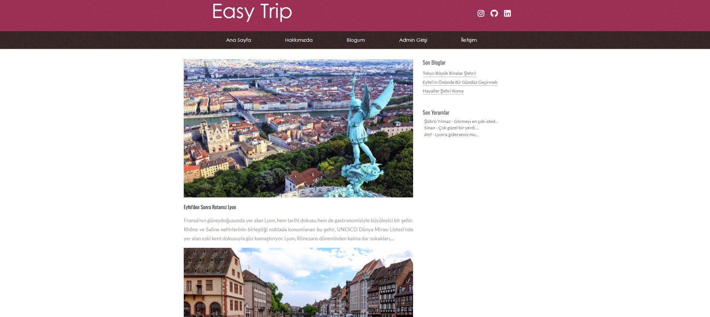
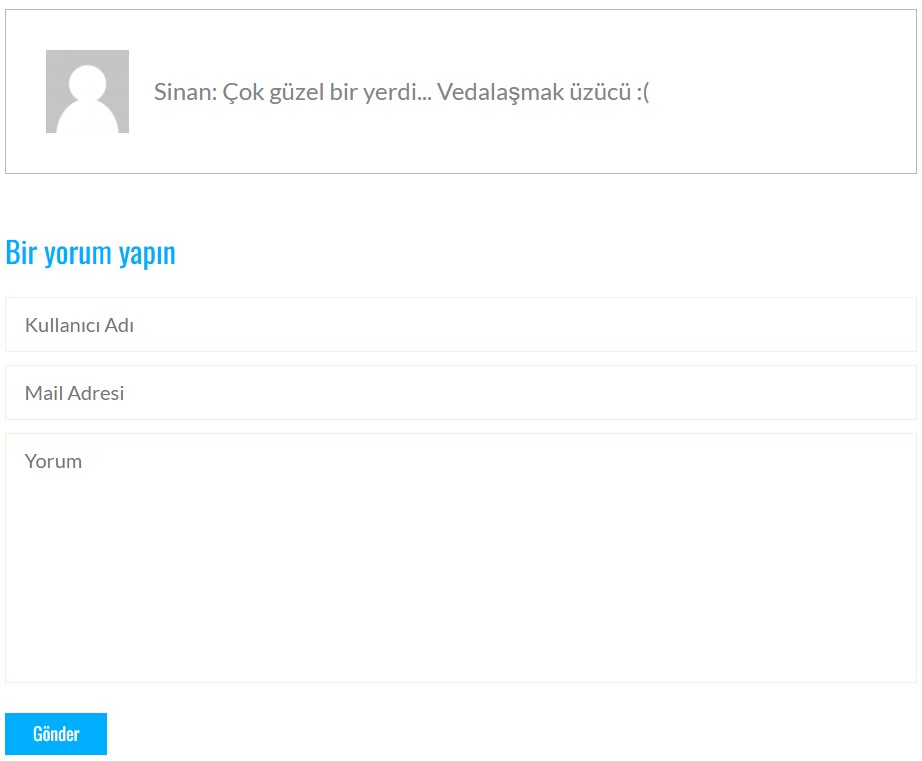
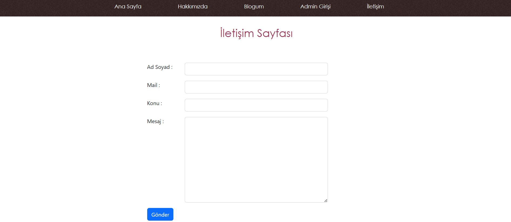
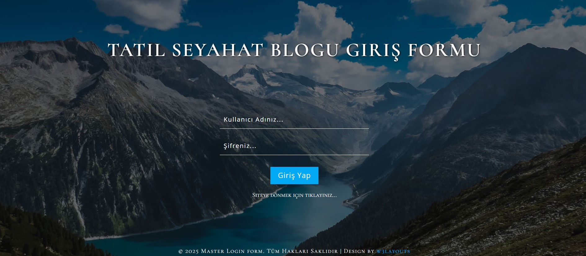
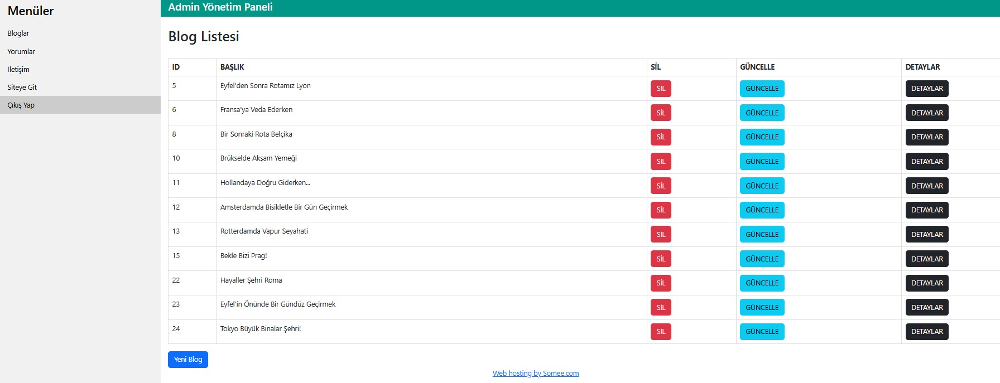

# Travel Trip
## Proje açıklaması
(Proje, benim tarafımdan backend kodlamasıyla geliştirilmiş olup, tasarım **W3Layouts** tarafından sağlanmıştır.) 
Bu proje sadece yazar tarafından yazılan blog içeriklerine sahip bir seyahat blogudur. Kullanıcılar, içeriklere yorum yaparak yazara geri bildirimde bulunabilir ancak içerik yalnızca yazar tarafından yönetilir.

## 🚀 Proje Özellikleri
- **Kullanıcı Dostu Arayüz**: Basit ve anlaşılır bir kullanıcı arayüzü ile kolay gezinti sağlanmıştır.
- **Blog Yazıları**: Kullanıcılar yalnızca yazarı tarafından yazılmış blog yazılarını görüntüleyebilir ve yorum yapabilir.
- **Yorum Sistemi**: Kullanıcılar yazılar altına yorum bırakabilirler.
- **Veri Tabanı Entegrasyonu**: Blog yazıları ve kullanıcı yorumları, SQL Server veri tabanında güvenli bir şekilde saklanır.
- **Admin Paneli**: 
  - Admin, blog yazılarını ve yorumları yönetebilir.
  - İletişim kutusundan gönderilen mesajlar admin paneline düşer ve yönetici tarafından okunabilir.
  - Blog yazılarına yeni içerik eklenebilir, var olan yazılar düzenlenebilir veya silinebilir.

## 🖼 Ekran Görüntüleri
<table>
  <tr>
    <td></td>
    <td></td>
  </tr>
  <tr>
    <td></td>
    <td></td>
  </tr>
  <tr>
    <td></td>
    <td></td>
  </tr>
  <tr>
    <td colspan="2"></td>
  </tr>
</table>

## 🔧 Kullanılan Teknolojiler

Bu projede aşağıdaki teknolojiler ve araçlar kullanılmıştır:

- **W3Layouts**: Proje için taslak ve önceden yapılmış HTML/CSS şablonu sağlayan platform.
- **ASP.NET MVC 5**: Web uygulaması geliştirme için kullanılan çerçeve.
- **C#**: Uygulama mantığını yazmak için kullanılan ana programlama dili.
- **HTML5**: Sayfa yapısını oluşturmak için kullanılan temel işaretleme dili.
- **CSS3**: Sayfa stilini düzenlemek için kullanılan stil sayfaları.
- **jQuery**: Dinamik içerik ve etkileşimler için kullanılan JavaScript kütüphanesi.
- **SQL Server**: Veri tabanı yönetim sistemi, verilerin saklanması ve sorgulanması için kullanıldı.
- **Visual Studio**: Geliştirme ortamı, proje geliştirme ve hata ayıklama işlemleri için kullanıldı.

## 👨‍💻 Geliştirici

- **Muhammed Mustafa Demirhan**
- Instagram: [@mami.dmrhn](https://www.instagram.com/mami.dmrhn/)
- LinkedIn: [Muhammed Mustafa Demirhan](https://www.linkedin.com/in/muhammedmustafademirhan/)
